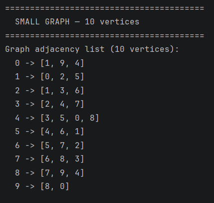
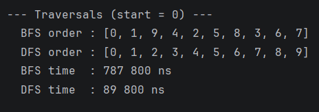
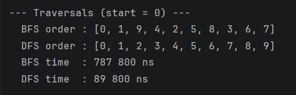
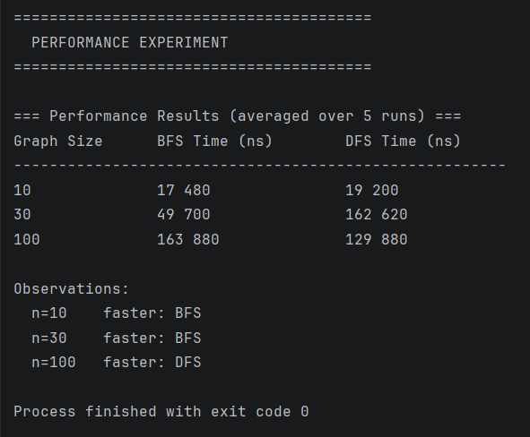

## A. Project Overview

This project is about graph traversal in Java.

A graph is a data structure made of vertices and edges. Vertices are the nodes of the graph, and edges are the connections between them.

In this project, each vertex has an integer id. Each edge connects two vertices. The graph is undirected, so the connection works in both directions.

For example, if vertex 0 is connected to vertex 1, then vertex 1 is also connected back to vertex 0.

This project includes two traversal algorithms: BFS and DFS.

BFS means Breadth First Search. It visits the closest neighbours first.

DFS means Depth First Search. It goes deeper into the graph before going back.

## B. Class Descriptions

Vertex

The Vertex class represents one node in the graph. It stores an id for the vertex. The class has a constructor, a getter, and a toString method.

Edge

The Edge class represents a connection between two vertices. It stores the source vertex and the destination vertex. The class also has getters and a toString method.

Graph

The Graph class represents the whole graph. I used an adjacency list to store the graph. An adjacency list means that each vertex has a list of its neighbours.

Example:

0 -> [1, 9, 4]
1 -> [0, 2, 5]
2 -> [1, 3, 6]

This representation is useful because it only stores existing edges.

The main methods in the Graph class are addVertex, addEdge, printGraph, bfs, and dfs.

Experiment

The Experiment class is used to test the performance of BFS and DFS. It runs the algorithms on graphs with 10, 30, and 100 vertices. The time is measured using System.nanoTime().

## C. Algorithm Descriptions

BFS

BFS stands for Breadth First Search. It starts from one vertex and visits all nearby vertices first. After that, it moves to the next level of vertices.

Steps:

1. Add the starting vertex to a queue.
2. Mark the starting vertex as visited.
3. Remove the first vertex from the queue.
4. Add all unvisited neighbours to the queue.
5. Repeat until the queue is empty.

BFS is useful when we need to find the shortest path in an unweighted graph.

Time complexity: O(V + E)

DFS

DFS stands for Depth First Search. It starts from one vertex and goes as deep as possible before going back.

Steps:

1. Add the starting vertex to a stack.
2. Take the top vertex from the stack.
3. If the vertex was not visited, mark it as visited.
4. Add its unvisited neighbours to the stack.
5. Repeat until the stack is empty.

DFS is useful for exploring paths, checking graph structure, and finding connected components.

Time complexity: O(V + E)

## D. Experimental Results

I tested the program with three graph sizes: 10 vertices, 30 vertices, and 100 vertices.

The results are averaged over 5 runs.

| Graph Size | Edges | BFS Time ns | DFS Time ns |
|------------|-------|-------------|-------------|
| 10         | 15    | 17,480      | 19,200      |
| 30         | 45    | 49,700      | 162,620     |
| 100        | 150   | 163,880     | 129,880     |

Observations

For 10 vertices, BFS was a little faster than DFS.

For 30 vertices, BFS was faster than DFS.

For 100 vertices, DFS was faster than BFS.

Both algorithms depend on the number of vertices and edges. This matches the expected time complexity O(V + E).

The time can be different in each run because it depends on the computer, JVM, and system performance.

## E. Screenshots

Graph Structure Output

BFS Traversal Output

DFS Traversal Output

Performance Results

## F. Reflection

In this assignment, I learned how graphs can be represented in Java using an adjacency list. I also learned how vertices and edges are connected inside a graph.

BFS and DFS are both used to visit vertices, but they work differently. BFS uses a queue and visits neighbours first. DFS uses a stack and goes deeper before returning back.

The main challenge was understanding why BFS and DFS give different traversal orders. Another challenge was measuring the time correctly, because the result can change when the program is run again.